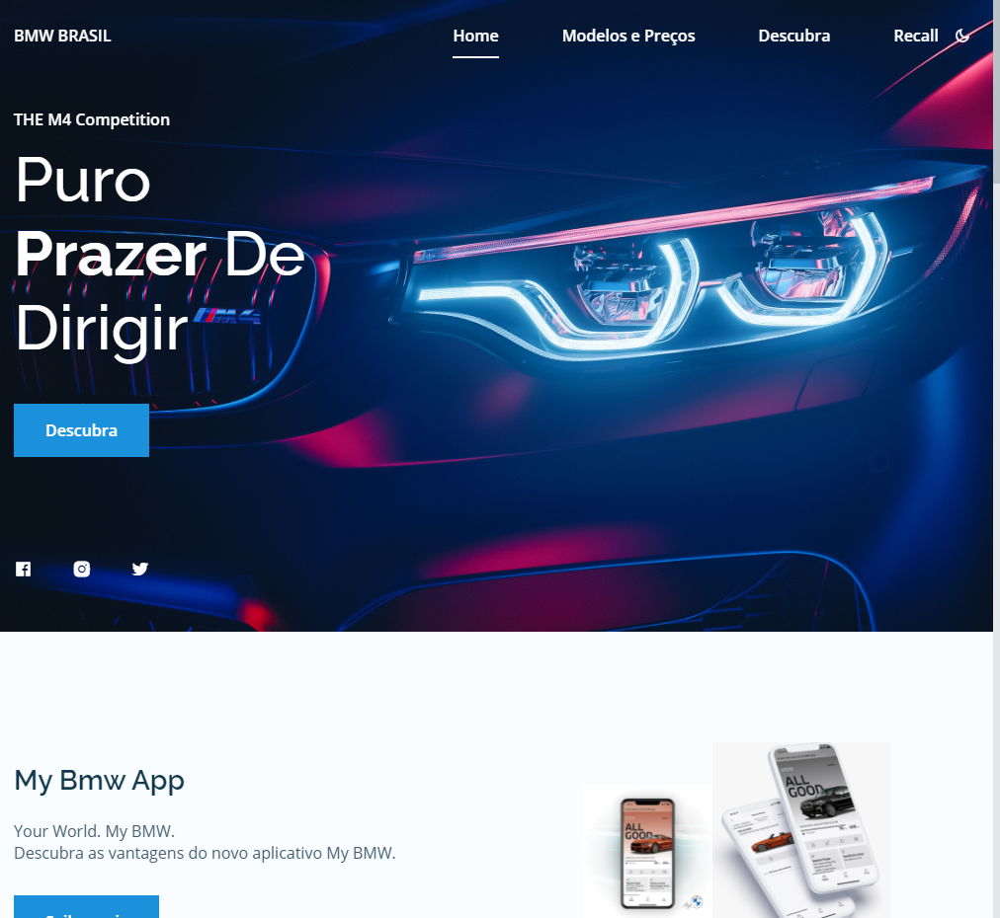

   

<h1 align="center">Como Utilizar o Projeto</h1>

Para utilizar o projeto será igualmente funcional a utilizar um projeto HTML junto com CSS inicialize o projeto no arquivo index.html

<h1 align="center">Sobre o Projeto 👨🏻‍💻</h1>

<h4 align="center">Site da Bmw em estagio de testes para ser um Framework para mim na criação de outros sites</h4>

 

ÍNDICE 
<a href="#Sobre o Projeto">Sobre</a> •
<a href="#Imagem">Imagem</a> •
<a href="#Tecnologias">Tecnologias</a> •
<a href="#Ferramentas">Ferramentas</a>

 

<h2 align="center">Imagem</h2>

<h1 align="center">
   
</h1>

  ### Tecnologias 🚀

  As seguintes ferramentas foram usadas na construção do projeto:

  - [x] **HTML**
  - [x] **CSS**
  - [x] **JS**
  - [x] **SCSS**

  #### Ferramentas

  - [**VS CODE**](https://code.visualstudio.com/)
  - [**BOOTSTRAP**](https://getbootstrap.com/)

 

  
Made with 💜 by FELIPE HOLANDA 👋🏻  [See my Linkedin](https://www.linkedin.com/in/felipe-holanda-de-freitas-3a91281a2/)</p
  
  
